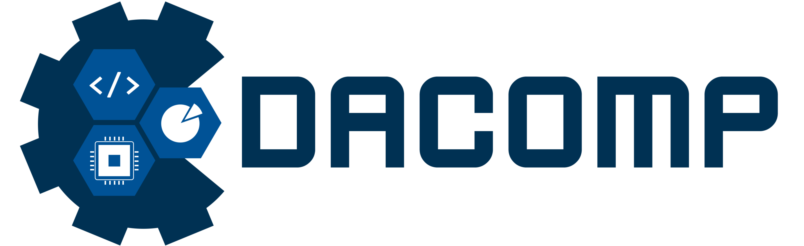
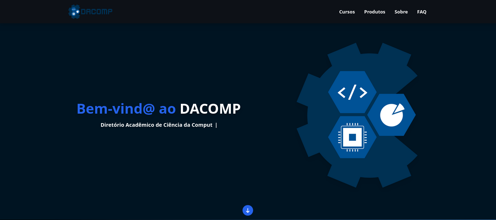

# DACOMP UNIFEI


## Sobre
Nesse projeto, nós criamos um site para o Diretório Acadêmico de Computação da Universidade Federal de Itajubá. A idéia surgiu da necessidade de ter um lugar que reúna todas as informações sobre o Diretório Acadêmico e também sobre os três cursos da qual é composto. O projeto foi desenvolvido para o projeto final da capacitação da empresa júnior byron.solutions.



## Tecnologias utilizadas
O projeto foi desenvolvido utilizando as seguintes tecnologias:
- HTML
- CSS
- TypeScript
- Next.js
- React
- Tailwind
- Git
- GitHub

## Como baixar o projeto
```bash

   # clonar repositório
   $ git clone https://github.com/websterramos/dacomp.git

   # entrar no diretório
   $ cd dacomp

   # instalar as dependencias
   $ npm install

   #iniciar o projeto
   $ npm run dev

```
Desenvolvido por Diego Varella e Webster Ramos
